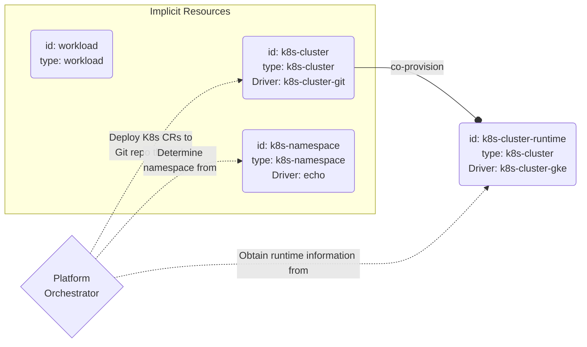

## Connecting to a Git repository (GitOps mode)

This section contains example Resource Definitions for connecting to a Git repository to push application CRs in [GitOps mode](https://developer.humanitec.com/integration-and-extensions/humanitec-operator/architecture/#modes-of-operation-gitops-mode).

It also provides a solution to specify the non GitOps-cluster where the GitOps deploys workloads.  
To retrieve the status of deployed workloads, the Orchestrator searches for a `k8s-cluster` Resource with the Id `k8s-cluster-runtime`. If it doesn't find this resource, it defaults to the `k8s-cluster` resource with the Id `k8s-cluster`. When the default cluster is a GitOps-managed cluster, an additional non-GitOps cluster is required to gather runtime information for workloads deployed by the GitOps operator. This example demonstrates that process.

The chart illustrates the setup. Because `k8s-cluster` is an [_implicit_  Resource Type](https://developer.humanitec.com/platform-orchestrator/reference/resource-types/#resource-type-use), one such Resource is always matched for any Deployment. This creates the Resource representing the GitOps cluster, using the `k8s-cluster-git` Driver. That resource co-provisions another Resource of type `k8s-cluster` with the Id `k8s-cluster-runtime` and the `k8s-cluster-gke` Driver, representing the runtime cluster.

These files make up the example:

* [github-for-gitops.yaml](github-for-gitops.yaml): contains configuration for connecting to a Git repository. This Resource Definition co-provisions a [GKE cluster](https://developer.humanitec.com/platform-orchestrator/examples/resource-definitions/#k8s-cluster-gke) to be used to fetch Runtime Information, the `k8s-cluster-runtime` Id is used in the co-provision key. This format is for use with the [Humanitec CLI](<https://developer.humanitec.com/>).
* [gke-temporary-credentials-runtime.yaml](gke-temporary-credentials-runtime.yaml): uses temporary credentials defined via a Cloud Account. The Resource Id specified in the Matching Criteria is `k8s-cluster-runtime` and it ensures that this Definition will be matched to provision the `k8s-cluster` Resource co-provisioned by the GitOps cluster Resource Definition. This format is for use with the [Humanitec CLI](https://developer.humanitec.com/platform-orchestrator/cli/)
* [`custom-namespace.yaml`](./custom-namespace.yaml): Shows how to use the Echo Driver to return the name of an externally managed namespace that must match the namespace where the GitOps Operator creates the resources. This format is for use with the [Humanitec CLI](https://developer.humanitec.com/platform-orchestrator/cli/).
