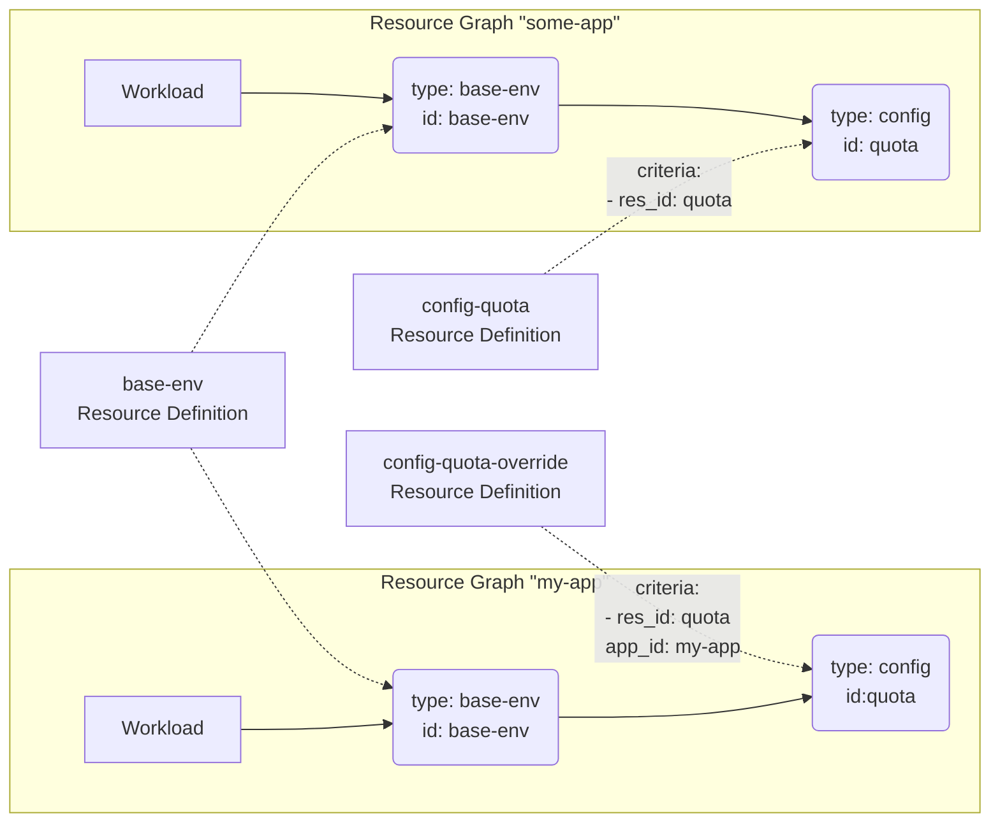

This example shows a sample usage of the `base-env` Resource Type. It is one of the _implicit_ [Resource Types](https://developer.humanitec.com/platform-orchestrator/reference/resource-types/) that always gets provisioned for a Deployment.

The Resource Definition [base-env-resourcequota.yaml](./base-env-resourcequota.yaml) uses it the provision a Kubernetes manifest describing a [ResourceQuota](https://kubernetes.io/docs/concepts/policy/resource-quotas/) in the target namespace.

The `base-env` Resource Definition reads the configuration values from another Resource of type `config` using a [Resource Reference](https://developer.humanitec.com/platform-orchestrator/resources/resource-graph/#resource-references). The reference specifies a class (`config#quota`) so that the proper `config` Resource Definition will be matched based on its matching criteria.

Two `config` Resource Definitions are provided:

- [config-quota.yaml](config-quota.yaml) will be matched for all references of `res_id: quota`
- [config-quota-override.yaml](config-quota-override.yaml) will additionally be matched for a particular `app_id: my-app` only, effectively providing an override for the configuration values for this particular Application id

The Resource Graphs for two Applications, one of which matches the "override" criteria, will look like this:

