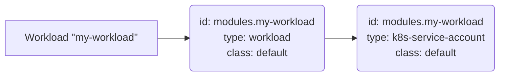

This section contains example Resource Definitions using the [Template Driver](https://developer.humanitec.com/integration-and-extensions/drivers/generic-drivers/template/) for provisioning Kubernetes [ServiceAccounts](https://kubernetes.io/docs/tasks/configure-pod-container/configure-service-account/) for your Workloads.

The solution consists of a combination of two Resource Definitions of type `workload` and `k8s-service-account`.

The [`workload` Resource Type](https://developer.humanitec.com/platform-orchestrator/reference/resource-types/#workload) is an [_implicit_](https://developer.humanitec.com/platform-orchestrator/reference/resource-types/#resource-type-use) Type which is automatically referenced for any Deployment.

This `workload` Resource Definition adds the `serviceAccountName` item to the Pod spec and references a [`k8s-service-account` type Resource](https://developer.humanitec.com/platform-orchestrator/reference/resource-types/#k8s-service-account), causing it to be provisioned. The `k8s-service-account` Resource Definition generates the Kubernetes manifest for the actual ServiceAccount.

A Resource Graph for a Workload using those Resource Definitions will look like this:

Note that the resource `id` is used in the `k8s-service-account` Resource Definition to derive the name of the actual Kubernetes ServiceAccount. Check the code for details.

Example files:

* [`cli-serviceaccount-workload-def.yaml`](./cli-serviceaccount-workload-def.yaml) and [`cli-serviceaccount-k8ssa-def.yaml`](./cli-serviceaccount-k8ssa-def.yaml): Resource Definition combination for Workload/ServiceAccount. This format is for use with the [Humanitec CLI](https://developer.humanitec.com/platform-orchestrator/cli/).
* [`tf-serviceaccount-workload-def.tf`](./tf-serviceaccount-workload-def.tf) and [`tf-serviceaccount-k8ssa-def.tf`](./tf-serviceaccount-k8ssa-def.tf): Resource Definition combination for Workload/ServiceAccount. This format is for use with the [Humanitec Terraform provider](https://registry.terraform.io/providers/humanitec/humanitec).