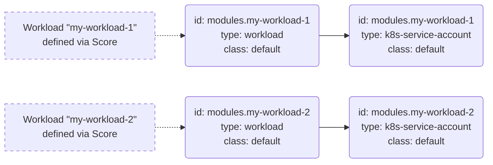
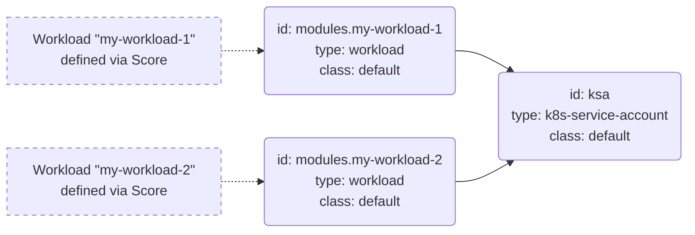

This section contains example Resource Definitions using the [Template Driver](https://developer.humanitec.com/integration-and-extensions/drivers/generic-drivers/template/) for provisioning Kubernetes [ServiceAccounts](https://kubernetes.io/docs/tasks/configure-pod-container/configure-service-account/) for your Workloads.

The solution consists of a combination of two Resource Definitions of type `workload` and `k8s-service-account`.

The [`workload` Resource Type](https://developer.humanitec.com/platform-orchestrator/reference/resource-types/#workload) is an [_implicit_](https://developer.humanitec.com/platform-orchestrator/reference/resource-types/#resource-type-use) Type which is automatically referenced for any Deployment.

This `workload` Resource Definition adds the `serviceAccountName` item to the Pod spec and references a [`k8s-service-account` type Resource](https://developer.humanitec.com/platform-orchestrator/reference/resource-types/#k8s-service-account), causing it to be provisioned. The `k8s-service-account` Resource Definition generates the Kubernetes manifest for the actual ServiceAccount.

The examples demonstrates two alternative approaches:

1. Providing a separate Kubernetes ServiceAccount for each Workload

    This approach lets you fine tune the permissions obtained via the ServiceAccount for each Workload, but create more objects in the Resource Graph and on the cluster.

2. Providing a single Kubernetes ServiceAccount for all Workloads in the same Application Environment

    This approach results in unified permissions for each Workload and less objects in the Resource Graph and on the cluster

For option 1, a Resource Graph for Workloads using those Resource Definitions will look like this:

For option 2, a Resource Graph for Workloads using those Resource Definitions will look like this:

Check the code in the Resource Definitions to activate the option you wish to use.

In both cases, the resource `id` is used in the `k8s-service-account` Resource Definition to derive the name of the Kubernetes ServiceAccount.