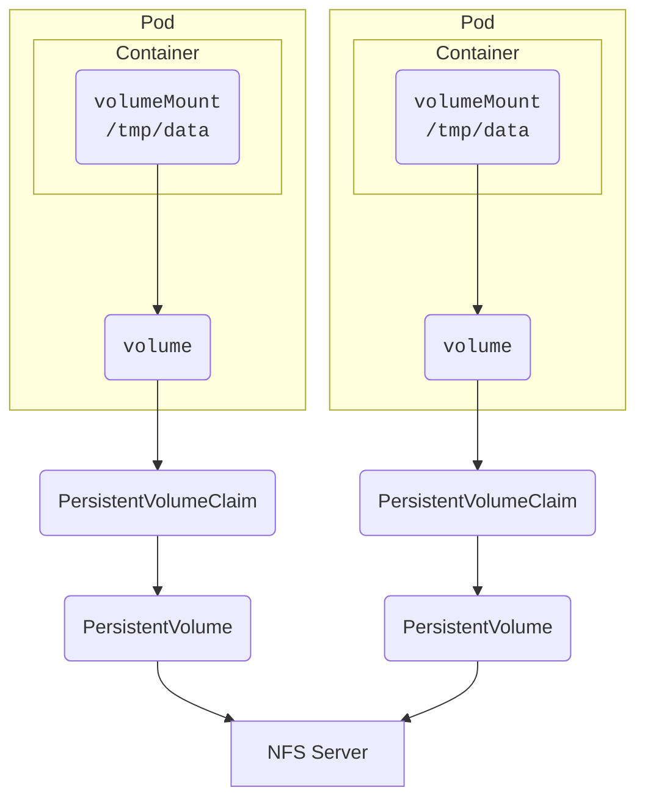
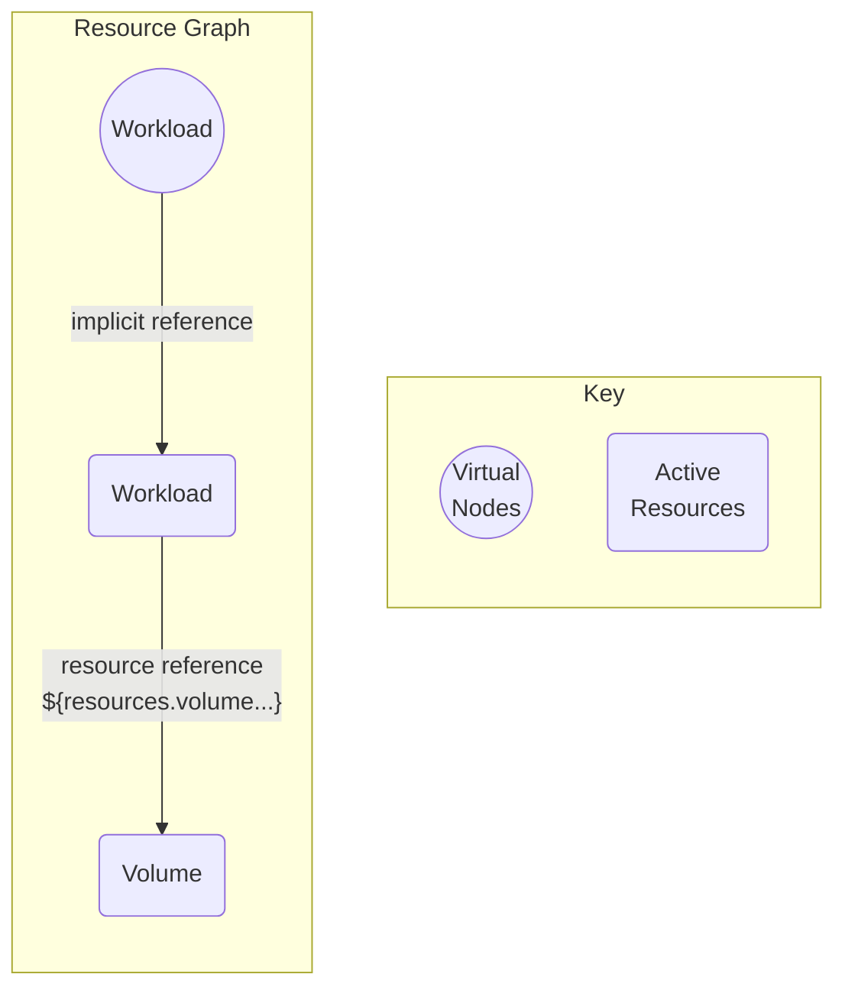

This example will let participating Workloads share a common persistent storage service through the Kubernetes [volumes](https://kubernetes.io/docs/concepts/storage/volumes) system.

It is possible to use the Drivers [`volume-nfs`](https://developer.humanitec.com/integration-and-extensions/drivers/volume-driver/network-file-system/) or [`volume-pvc`](https://developer.humanitec.com/integration-and-extensions/drivers/volume-driver/persistent-volume-claim/) to create a [PersistentVolume](https://kubernetes.io/docs/concepts/storage/persistent-volumes/) for your application. If you have special requirements for your PersistentVolume, you can also use the [Template Driver](https://developer.humanitec.com/integration-and-extensions/drivers/generic-drivers/template/) to create it as shown here.

The example setup will perform static provisioning for a Kubernetes [PersistentVolume](https://kubernetes.io/docs/concepts/storage/persistent-volumes/) of type [`nfs`](https://kubernetes.io/docs/concepts/storage/volumes/#nfs) and a corresponding [PersistentVolumeClaim](https://kubernetes.io/docs/concepts/storage/persistent-volumes/#persistentvolumeclaims). The volume points to an existing NFS server endpoint. The endpoint shown is an in-cluster NFS service which can be set up using this [Kubernetes example](https://github.com/kubernetes/examples/tree/master/staging/volumes/nfs). Modify the endpoint to use your own NFS server, or substitute the data completely for a different [volume type](https://kubernetes.io/docs/concepts/storage/volumes/#volume-types).

To use the example, apply both Resource Definitions to your Organization and add the required [matching criteria](https://developer.humanitec.com/platform-orchestrator/resources/resource-definitions/#matching-criteria) to both so they are matched to your target Deployments.

Note that this setup does _not_ require any `resource` to be requested via Score. The [_implicit_](https://developer.humanitec.com/platform-orchestrator/reference/resource-types/#resource-type-use) `workload` Resource, when matched to the Resource Definition of type `workload` of this example, will trigger the provisioning of the `volume` Resource through its own Resource reference.

Those files make up the example:

- [`workload-volume-nfs.yaml`](workload-volume-nfs.yaml): Resource Definition of type `workload`. It references a Resource of type `volume` through [Resource References](https://developer.humanitec.com/platform-orchestrator/resources/resource-graph/#resource-references), thus adding such a Resource to the Resource Graph and effectively triggering the provisioning of that Resource. It uses the Resource outputs to set a label for a fictitious backup solution, and to add the PersistentVolumeClaim to the Workload container.
- [`volume-nfs.yaml`](volume-nfs.yaml): Resource Definition of type `volume`. It creates the PersistentVolume and PersistentVolumeClaim manifests and adds the `volumes` element to the Workload's Pod. The ID generated in the `init` section will be different for each active Resource, i.e. for each Workload, so that each Workload will get their own PersistentVolume and PersistentVolumeClaim objects created for them. Still, through the common NFS server endpoint, they will effectively share access to the data.

The resulting Resource Graph portion will look like this:

