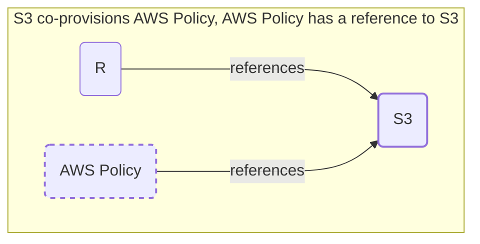

## Resource co-provisioning

This section contains an example of Resource Definitions using the [Terraform Driver](https://developer.humanitec.com/integration-and-extensions/drivers/generic-drivers/terraform/) and illustrating the [co-provisioning](https://developer.humanitec.com/platform-orchestrator/resources/resource-graph/#co-provision-resources) concept.

Scenario: For each AWS S3 bucket resource an AWS IAM policy resource must be created. The bucket properties (region, ARN) should be passed to the policy resource. 
In other words, an IAM Policy resource depends on a S3 resource, but it needs to be created automatically.

Any time a Resource `R` references a S3 resource using this Resource Definition, an IAM Policy resource will be co-provisioned and reference the S3 resource. The resulting Resource Graph will look like this:

