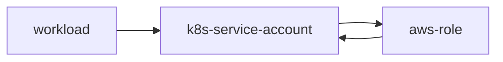
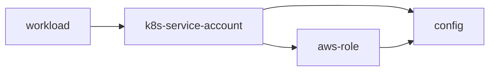

# Break a loop with an additional resource

This example demonstrates how to break a loop where two resources have to both depend on each others outputs. 

## How the example works

There is often a mutual loop assigning a principal to a Kubernetes service account to enable Workload Identity. The Kubernetes service account often needs to be annotated with the principal and the principal needs some policy to allow it to be used by the Kubernetes Service Account.

In this example, we will simulate the graph using a `k8s-service-account` and a fake `aws-role` resource both implemented with the [`humanitec/template`](https://developer.humanitec.com/integration-and-extensions/drivers/generic-drivers/template/) driver.

The loop arises because it is necessary to generate both the Kubernetes service account name and the aws-role dynamically. This is because these need to be unique for each Workload in the Application. Essentially, both resources require the same two pieces of information.

There are two ways to break the loop: 

1. Convention

   Decide that each resource "knows" how to generate both pieces of information. This can be achieved by using the context to provide the unique element.

   This has the downside that it is inflexible and limiting. For example, if a 3rd party system is used to issue principals, then this technique will not work.

2. Add an additional resource

   Both the `k8s-service-account` and `aws-role` resources get _both_ the service account name and role ID from a 3rd resource.

   This approach ensures consistency, does not rely on convention and allows for complex scenarios like getting IDs from a 3rd party system.

