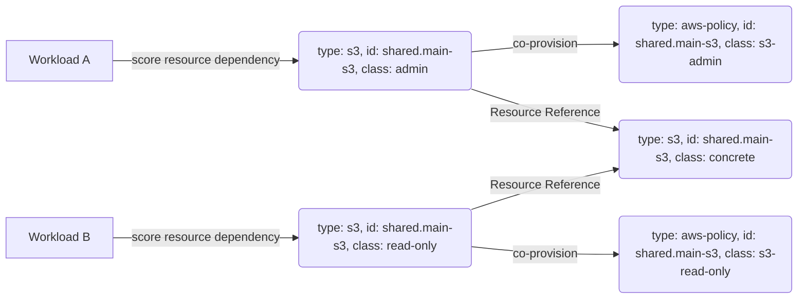

# Delegator Resource

This example demonstrates how delegator [Resource Definitions](https://developer.humanitec.com/platform-orchestrator/resources/resource-definitions/) can be used to expose
a shared base resource with different access policies.

## How the example works

This example is made up of:

* Two delegator `s3` Resource Definitions
* One base `s3` Resource Definition
* Two `aws-policy` Resource Definitions

and the resulting graph will look like:



To keep the examples as simple as possible, the [`humanitec/echo`](https://developer.humanitec.com/integration-and-extensions/drivers/generic-drivers/echo/) driver is used throughout. Check out the [Resource Packs](https://developer.humanitec.com/platform-orchestrator/resources/resource-packs/) if you are interested in examples with Resource Definitions that also include provisioning.

The `s3` Resource Definition [`def-s3-concrete.yaml`](./def-s3-concrete.yaml) defines the underlying "base" resource and is matched as `class: concrete`.

In a real-world setup, this Resource Definition is the only one that would actually provision the s3 bucket using a Driver other than Echo, e.g. the [Terraform Driver](https://developer.humanitec.com/integration-and-extensions/drivers/generic-drivers/terraform/). The delegator resources will _not_ actually provision anything. Their purpose is the co-provisioning of the appropriate `aws-policy` resource based on their `class`.

The `aws-policy` Resource Definitions [`def-aws-policy-s3-admin.yaml`](./def-aws-policy-s3-admin.yaml) and [`def-aws-policy-s3-read-only.yaml`](./def-aws-policy-s3-read-only.yaml) contain the different policies we want to make available. Those are matched as `admin` and `read-only`.

The `s3` Resource Definitions [`def-s3-admin.yaml`](./def-s3-admin.yaml) and [`dev-s3-read-only.yaml`](./def-s3-read-only.yaml) are delegator resources that have two functions:

* Co-provision the respective `aws-policy` Resource Definition.
* Forward the outputs of the "base" resource using a [Resource Reference](https://developer.humanitec.com/platform-orchestrator/resources/resource-graph/#resource-references).

When the workload defined in [`score-a.yaml`](./score-a.yaml) now requests an `s3` resource with `class: admin`, the Humanitec Platform Orchestrator creates the "delegator" `s3` resource `class: admin`, the "base" `s3` resource `class: concrete`, and co-provisions the `aws-policy` resource `class: s3-admin`.

Similar to the first workload, [`score-b.yaml`](./score-b.yaml) requests an `s3` resource, but this time with `class: read-only` and here the Humanitec Platform Orchestrator creates the "delegator" `s3` resource `class: read-only`, the "base" `s3` resource `class: concrete`, and co-provisions the `aws-policy` resource `class: s3-read-only`.

As both workloads used the same `s3` resource id `main-s3` via the `id` property on the `resource` objects in their Score files, they will use the same resource and thus the same underlying s3 bucket, but each workload uses a different access policy. The [Score schema reference](https://docs.score.dev/docs/score-specification/score-schema-reference/) has details on this property.

## Run the demo

### Prerequisites

See the [prerequisites section](../README.md#prerequisites) in the README at the root of this section.

In addition, set these environment variables:

```bash
export HUMANITEC_APP=example-delegator
export HUMANITEC_ENV=development
export HUMANITEC_ORG=<your-org-id>
```

### Cost

This example will result in a two Pods being deployed to a Kubernetes cluster.

### Deploy the example

1. Login to the Platform Orchestrator:

   ```bash
   humctl login
   ```

2. Create a new app:

   ```bash
   humctl create app "${HUMANITEC_APP}"
   ```

3. Register the Resource Definitions:

   ```bash
   mkdir resource-definitions
   cp def-*.yaml ./resource-definitions
   humctl apply -f ./resource-definitions
   ```

4. Deploy the Score workload A:

   ```bash
   humctl score deploy --org "${HUMANITEC_ORG}" --app "${HUMANITEC_APP}" --env "${HUMANITEC_ENV}" --file score-a.yaml
   ```

5. Deploy the Score workload B:

   ```bash
   humctl score deploy --org "${HUMANITEC_ORG}" --app "${HUMANITEC_APP}" --env "${HUMANITEC_ENV}" --file score-b.yaml
   ```

6. Create the Resource Graph:

   ```bash
   humctl resources graph --org "${HUMANITEC_ORG}" --app "${HUMANITEC_APP}" --env "${HUMANITEC_ENV}" > graph.dot
   ```

### Clean up the example

1. Delete the Application:

   ```bash
   humctl delete app "${HUMANITEC_APP}"
   ```

2. Delete the Resource Definitions:

   ```bash
   humctl delete -f ./resource-definitions
   rm -rf ./resource-definitions
   ```
