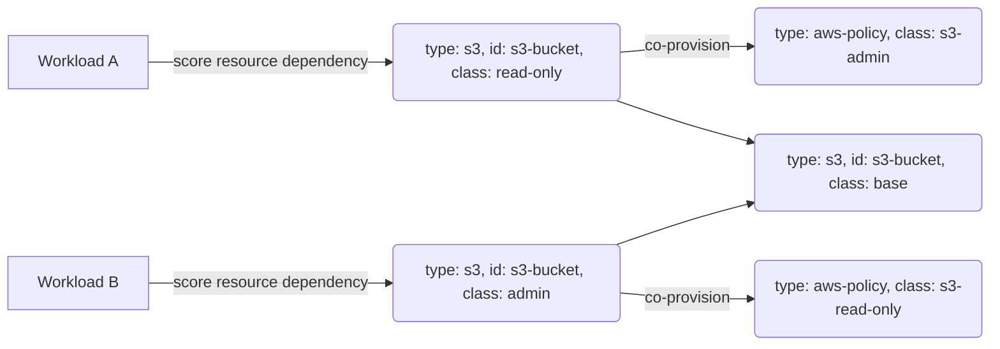

# Proxy Resource

This example demonstrates how proxy [Resource Definitions](https://developer.humanitec.com/platform-orchestrator/resources/resource-definitions/) can be used to expose
a shared base resource with different access policies.

## How the example works

This example is made up of:

* Two proxy `s3` Resource Definitions
* One base `s3` Resource Definition
* Two `aws-policy` Resource Definitions

and the resulting graph will look like:



To keep the examples as simple as possible, the [`humanitec/echo`](https://developer.humanitec.com/integration-and-extensions/drivers/generic-drivers/echo/) driver is used. Checkout [Resource Packs](https://developer.humanitec.com/platform-orchestrator/resources/resource-packs/), if you are interested in examples with Resource Definitions that also include provisioning.

The `s3` Resource Definition [`s3-example.yaml`](./resource-definitions/s3-example.yaml) defines the underlying "base" resource and is exposed matched as `class: example`.

The `aws-policy` Resource Definitions [`aws-policy-s3-example-admin.yaml`](./resource-definitions/aws-policy-s3-example-admin.yaml) and [`aws-policy-s3-example-read-only.yaml`](./resource-definitions/aws-policy-s3-example-read-only.yaml) contain the different policies we want to make available. Those are matched as `example-admin` and `example-read-only`.

The `s3` Resource Definitions [`s3-example-admin.yaml`](./resource-definitions/s3-example-admin.yaml) and [`s3-example-read-only.yaml`](./resource-definitions/s3-example-read-only.yaml) are proxy resources that have two functions:

* Co-provision the respective `aws-policy` Resource Definition.
* Forward the outputs of the "base" resource using a [Resource Reference](https://developer.humanitec.com/platform-orchestrator/resources/resource-graph/#resource-references).

When the workload defined in [`score-a.yaml`](./score-a.yaml) now requests an `s3` resource with `class: example-admin`, the Humanitec Operator creates the "base" `s3` resource `class: example` and co-provisions the `aws-policy` resource `class: s3-example-admin`.

Similar to the first workload, [`score-b.yaml`](./score-a.yaml) requests an `s3` resource, but this time with `class: example-read-only` and here the Humanitec Operator creates the "base" `s3` resource `class: example` and co-provisions the `aws-policy` resource `class: s3-example-read-only`.

As both workloads used the same `s3` resource id `shared.main-s3`, they will use the same underlying s3 bucket, but each workload uses a different access policy.

## Run the demo

### Prerequisites

See the [prerequisites section](/README.md#prerequisites) in the README at the root of this section.

In addition, the environment variable `HUMANITEC_APP` should be set to `example-proxy`.

### Cost

This example will result in a two pods being deployed to a Kubernetes Cluster.

### Deploy the example

1. Create a new app:

   ```bash
   humctl create app "${HUMANITEC_APP}"
   ```

2. Register the resource definitions:

   ```bash
   humctl apply -f ./resource-definitions
   ```

3. Deploy the score workload A:

   ```bash
   score-humanitec delta --deploy --org "${HUMANITEC_ORG}" --app "${HUMANITEC_APP}" --env "${HUMANITEC_ENV}" --token "${HUMANITEC_TOKEN} --retry --file score-a.yaml
   ```

4. Deploy the score workload B:

   ```bash
   score-humanitec delta --deploy --org "${HUMANITEC_ORG}" --app "${HUMANITEC_APP}" --env "${HUMANITEC_ENV}" --token "${HUMANITEC_TOKEN} --retry --file score-b.yaml
   ```

### Clean up the example

1. Delete the Application:

   ```bash
   humctl delete app "${HUMANITEC_APP}"
   ```

2. Delete the Resource Definitions:

   ```bash
   humctl delete -f ./resource-definitions
   ```
