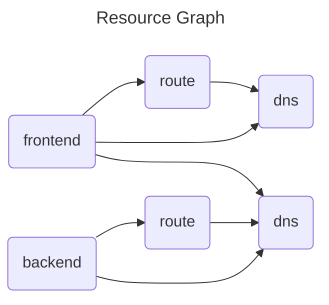

When several Workloads need to use the same real-world Resource, this can be modelled as a [Shared Resource](https://developer.humanitec.com/platform-orchestrator/resources/dependent-resources/#shared-resources-in-score).

Workloads using the Shared Resource will then reference the same node in the Resource Graph.

### Example: Shared DNS

This example shows a frontend and a backend workload. Both are exposed via DNS. The frontend is exposed via an external DNS, and it needs to access the backend via it associated DNS name as well. It therefore requires the backend DNS name to be injected as an environment variable.

To achieve this, the backend `dns` is made a Shared Resource by assigning it an `id` in the Score files. Both Score files need to use the same `id` to reference the same Resource.

Note that the Workloads refer to the Shared Resource using a different resource name (`api-dns` vs. `my-dns`). That name is local to the Score file and may be different.

The frontend has an additional `dns` for its own reachability. All `dns` resources are used in conjunction with a `route`.

The respective portions of the Resource Graph will then look like this:

Example files:

- [`score-frontend.yaml`](score-frontend.yaml): Score file for the frontend Workload
- [`score-backend.yaml`](score-backend.yaml): Score file for the backend Workload